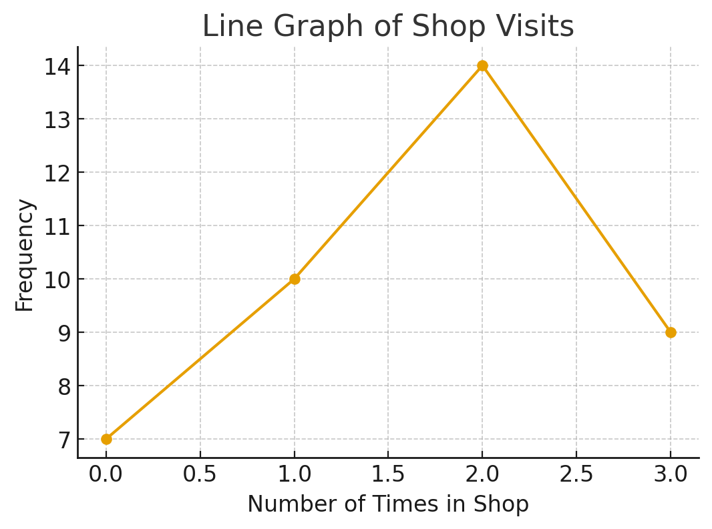
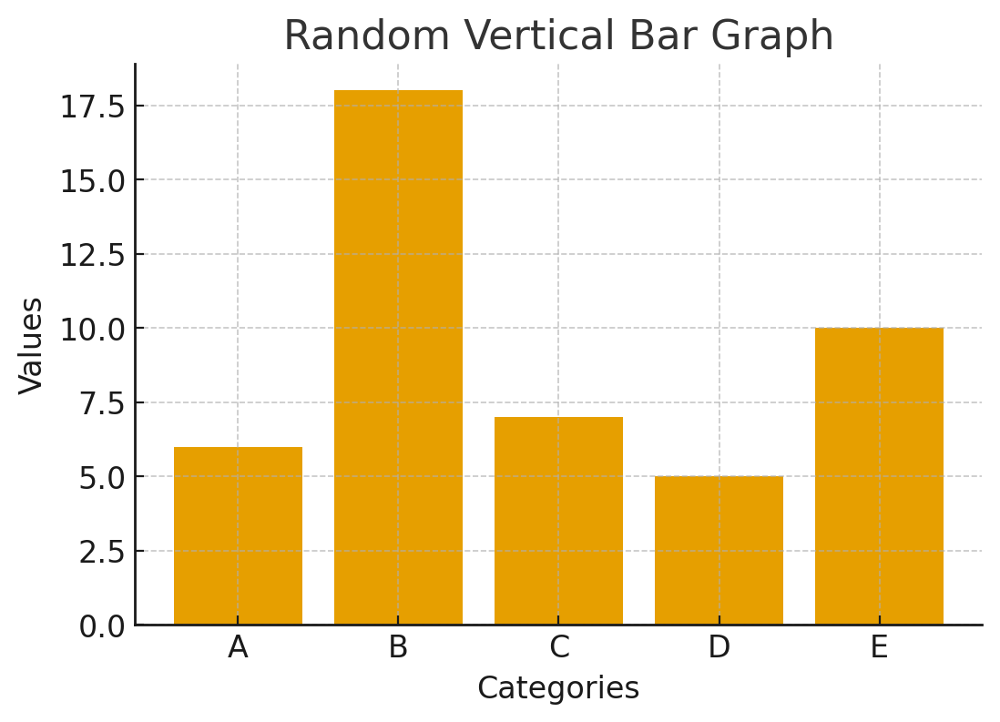

# 2.1 Stem and Leaf Graphs
## Stem plots, line graphs, and Bar Graphs

### Stem Plots

#### The stem and leaf graph, or stem plot, comes from the field of exploratory data analysis. (Good choice when data sets are small.)
#### Stem plots are a quick way to graph data and give the exact picture of the data.
#### To create the plot, divide each observation of data into a stem and a leaf. The leaf consists of a final significant digit. 

**Ex:**  23, 432, 5432

| Stem | Leaf |
| ---:|------|
|2 | 3|
|43 | 2|
|543 | 2|

> #### **Note**: An outlier is an observation of data that does not fit the rest of the data. Sometimes this is known as an **extreme value**. When Graphing an outlier, it will appear not to fit the pattern of the graph. Some outliers are clue to mistakes (**ex: writing down 50 instead of 500**), while others may indicate that something unusual is happening. 

---

#### A side by side stem and leaf plot allows a comparison of the two data sets in to columns. In a side by side stem and leaf plot, two sets of leaves share the same stem.
- The leaves are to the right and left of stems.

**Ex:**

Data set one: 52, 54, 55, 57, 61, 62, 64, 65, 66, 71, 73, 74

Data set two: 51, 53, 58, 59, 60, 63, 67, 68, 70, 72, 75, 79

| (data set one)Leaf | Stem | Leaf(data set two) |
|------:|:------:|:------|
|2 4 5 7| 5 | 1 3 8 9
|1 2 4 5 6 | 6 | 0 3 7 8
|1 3 4 | 7 | 0 2 5 9 |

---

### Line Graphs

#### Another type of graph that is useful for specific data values is a line graph. The **x-axis**(horizontal) consists of data values and the **y-axis**(vertical) consists of frequency points.
- Frequency points are connected using line segments. 

| # of times in shop | frequency |
|:------------------------:|:-----------:|
| 0 | 7|
| 1 | 10 |
| 2| 14 |
| 3| 9 |

- To find width: Subtract the lower limit from the first class(first data set) to the lower limit of the second class(second data set)
---

### Bar Graphs

Bar graphs consist of bars that are separate from each other. The Bars can be rectangles or they can be rectangular boxes(used in three-dimensional plots), and they can be vertical or horizontal. 

